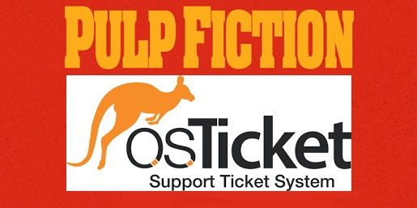
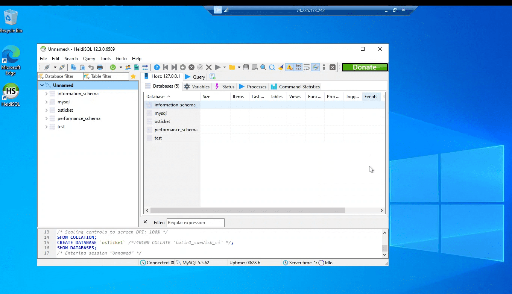
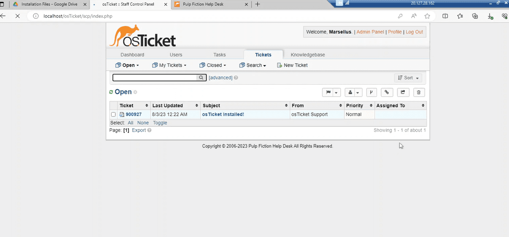
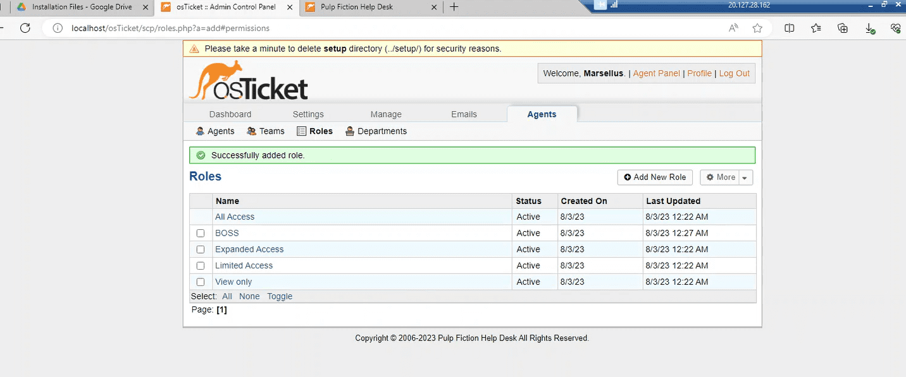

  
  
  <h1>Pulp Fiction osTicket</h1>
  <h2><i>Marcellus Wallace has a new way of handling his business...  by using Help Desk tickets!</i></h2>
   
  
For this demonstration I decided to base an open source ticket system and applied it to the movie Pulp Fiction.  
I will walk through the process of setting up OsTicket through a virtual machines in a cloud environment using Microsoft Azure.

<h3>Environments and Technologies Used:</h3>
Microsoft Azure 
osTicket software 
Remote Desktop 
HeidiSQL

<h3>Operating Systems Used:</h3>
Windows 10

<h4>STEP 1: SETTING UP AN ENVIRONMENT IN MICROSOFT AZURE</h4>

In the initial step I set up a Resource Group and created a virtual machine. After setting up a Microsoft 10 operating system and creating a user and password, I copied the public IP address and used a remote desktop connection to log in. Inside the virtual machine is where I will set up osTicket.
 

<h4>STEP 2: SETTING UP IIS</h4>

Here I set up all the correct configurations for IIS to run.  This is to ensure that we can get osTicket up and running.

<h4>STEP 3: SETTING UP OSTICKET</h4>

With help from the Information Technology course on CourseCareers, I have a supply of files to download in order to get osTicket running.  Some of these include the osTicket ticket software, PHP software, and a HeidiSQL database.

<h4>STEP 4: PROFILE INFORMATION</h4>

In this section I filled in all the information that was asked in order to continue setting up. Notice towards the bottom of the screenshot where it asks about database in the required fields.  The database information here was set with provided information from when we downloaded and installed HeidiSQL.

<h4>STEP 5: LOGGING INTO OSTICKET</h4>

After setting up my profile and database, I then logged in to osTicket to verify that it works.  As you can see here, it works and brings us to the main screen to see what tickets may be awaiting us.

<h4>STEP 6: ADDING ROLES, ADMINS, SLA PLANS, HELP TOPICS, AND USERS</h4>

Now that we are all set up, the gangsters need to start putting in requests to Marsellus Wallace for their needs. 
So I set up some roles, Admins, and created an SLA Plan <i>(normally there will be various types of SLA, but in the gangster realm only 1 or 2 should suffice).</i> Then I created some Help Topics and then some Users, so Jules and Vincent can log in when something bad goes down. Like when they needed the aid of The Wolf to clean up a messy situation.

<h4>STEP 7: CREATING A HELP DESK TICKET</h4>

Now that everything is set up, it's time for the Users to start submitting requests.  Once a ticket is submitted, they will be assigned to the appropriate agent or admin with the correct SLA and have any comments noted in regards with the issue of the ticket.

<h4>STEP 8: LOGGING OFF THE REMOTE DESKTOP</h4>

Now that the project has been set up, tested, and practiced on, it's now time to dismantle our project.  This start of this is simply ending the remote session by either logging out of the virtual machine or clicking on X.

<h4>STEP 9: DELETING OUR PROJECT</h4>

With Microsoft Azure, you will have to pay for what you use unless you have some free credits when you initially sign up.
However when you keep your environment running it'll cost you. 
So essentially here we go back into the Azure and delete our Virtual Machine and Resource Group.
  

 
 
 
<i>"The path of the righteous man is beset on all sides by the inequities of the selfish and the tyranny of evil men. 
Blessed is he who, in the name of charity and good will, shepherds the weak through the valley of the darkness, 
for he is truly his brother's keeper and the finder of lost children. 
And I will strike down upon thee with great vengeance and furious anger those who attempt to poison and destroy My brothers. 
And you will know I am the Lord when I lay My vengeance upon you."</i> 
It's just not a good idea.

